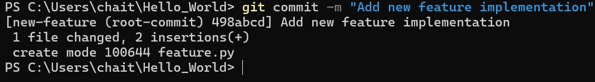

# Git-_Bash-_Commands-_Execution\
Configure your Git with your name and email. #Commands:

Clone the project repository from GitHub. #Commands:

Create a new feature branch. #Commands:

Add a new file called feature.py to your branch. #Commands:

Commit your changes with a message. #Commands:

Push your changes to the remote repository. #Commands:

Pull the latest changes from the main branch. #Commands:

Remove the feature.py file from your branch. #Commands:

Commit the removal of the file and push the changes. #Commands:

